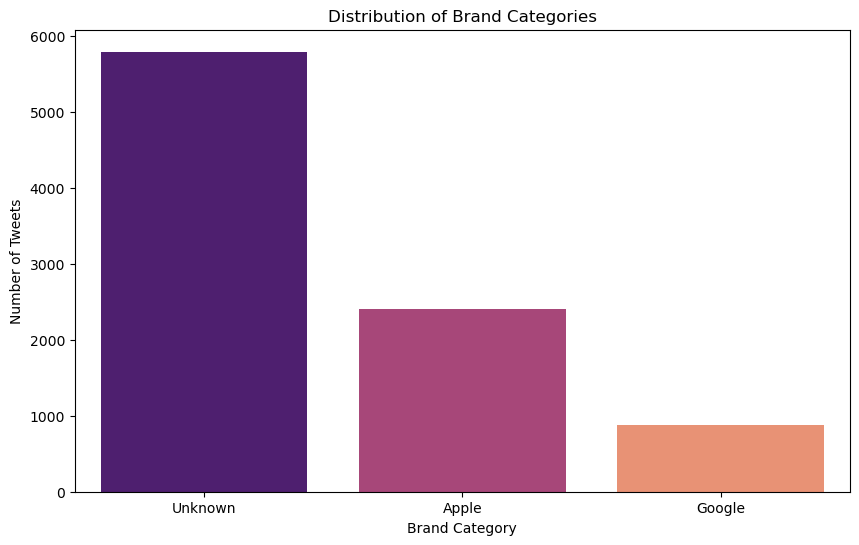
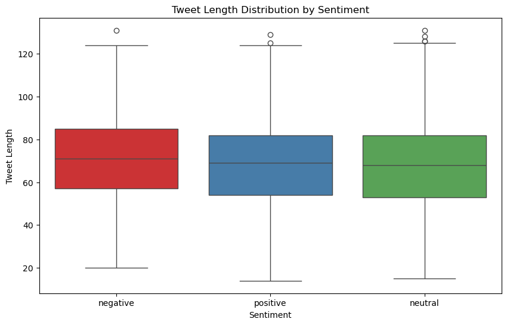
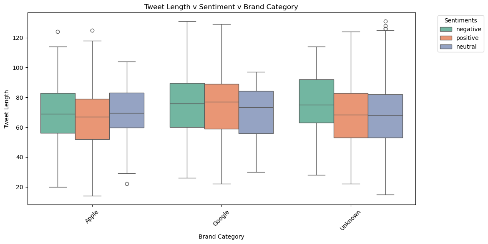
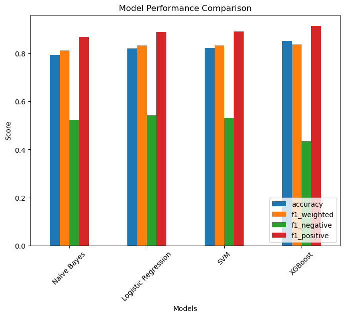
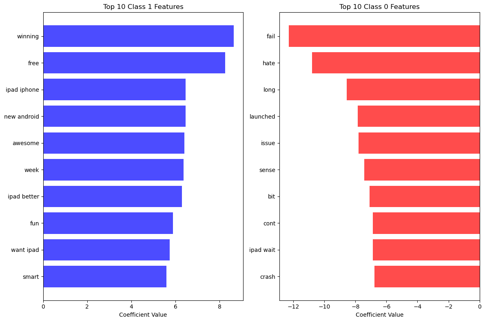

# DSC-PHASE-4-GROUP-7-
# Twitter Sentiment Analysis
## STEP 1: Business understanding
### Project Overview
Sentiment analysis, also known as opinion mining, is a Natural Language Processing (NLP) technique used to automatically determine the emotional tone behind textual content. Companies leverage sentiment analysis of tweets to get a sense of how customers are talking about their products and services, get insights to drive business decisions and identify product issues and potential PR crises early on.

A 2023 systematic review published in Information Processing & Management confirms that social media analytics have become a cornerstone of business intelligence, directly enabling data-driven decisions in product innovation and competitive positioning. This project applies sentiment analysis to tweets about Apple and Google products, aiming to classify and analyze public opinion. The insights will help technology companies identify emerging issues, leverage positive feedback, and make strategic decisions based on real-time customer sentiment.

### Problem Statement
Apple and Google face the challenge of managing customer opinions expressed on social media. Negative sentiment about products or services can quickly harm brand perception, reduce customer loyalty, and impact sales.Without an automated solution, emerging product issues or trending complaints may go unnoticed, leading to reputational risks and missed market opportunities.This project aims to address this problem by using Natural Language Processing (NLP) to classify and analyze tweets, enabling Apple and Google to respond promptly, leverage positive feedback and make data-driven strategic decisions.

### Business Objectives
#### Main Objective
To build an NLP model that can rate the sentiment of a Tweet based on its content.

#### Specific Objectives
1. Develop machine learning model to classify tweets as positive or negative.
2. To clean and preprocess raw Twitter text data for analysis.
3. To explore and visualize sentiment distribution between Apple and Google products
4. To evaluate model performance using appropriate metrics such as accuracy and precision to ensure reliability.
#### Research Questions
1. How can a machine learning model be developed to classify tweets as positive or negative?
2. What methods can be used to clean and preprocess raw Twitter text data to prepare it for analysis?
3. How can the sentiment distribution between Apple and Google products be explored and visualized effectively?
4. Which evaluation metrics (such as accuracy and precision) can be used to assess the model’s performance and ensure its reliability?
#### Success Criteria
1. Model performance: The NLP model achieves a high level of accuracy and reliability in classifying tweet sentiments (positive, negative)
2. Actionable insight: The analysis provides clear, data-driven insights into public perceptions of Apple and Google products.

## STEP 2: Data Understanding

The dataset for this project comes from CrowdFlower via data.world and consists of tweets related to Apple and Google products. The dataset contains a total of 9,093 records and 3 features. Most tweets are text-based and include user mentions, hashtags and product names.

Key Features in the Dataset:
1. `tweet_text` - The actual content of the tweet as written by the user. This serves as the main input for Natural Language Processing (NLP) to determine the expressed sentiment.
2. `emotion_in_tweet_is_directed_at` - Specifies the brand, company or product that the emotion is directed at (e.g., Apple, Google, iPhone, Android). This helps in comparing sentiment between brands.
3. `is_there_an_emotion_directed_at_a_brand_or_product` - The target variable indicating whether a tweet expresses a positive, negative, or neutral emotion toward a brand or product.

### Libraries Used
1. Data Manipulation: numpy, pandas
2. Visualization: matplotlib, seaborn
3. Modeling and Evaluation: scikit-learn (LogisticRegression, RandomForestClassifier, permutation_importance, RandomizedSearchCV), imblearn (SMOTE)
5. Gradient Boosting: Implied use of xgboost or similar for feature importance analysis.
6. TensorFlow:  For training and inference of neural networks

## STEP 3: Data Preparation and Exploratory Data Analysis (EDA)
### Data Preparation
- Text cleaning and preprocessing (lowercasing, punctuation removal)
- Tokenization and stopword removal
- TF-IDF vectorization
- Train-test split
- Feature Engineering: Target variable was encoded (e.g., label encoding).
- Class Imbalance: The imbalanced sentiment target was balanced using SMOTE to improve model performance.

### EDA 
Visualizations: Over 10 visualizations were created, including bar plots, heatmaps, and correlation matrices, to explore relationships between the tweets text and the nature of sentiment.
Below are some of the selected visualizations made from the project analysis:

1. Univariate

2. Bivariate

3. Multivariate

## STEP 4: Modelling
### Approach
Train-Test Split: The dataset was split into training and testing sets (e.g., 80/20 ratio) using train_test_split.
Models Built:
 **Multinomial Naive Bayes**
- **Logistic Regression** (including hyperparameter tuning via GridSearchCV)
- **Support Vector Machine (SVM)**
- **XGBoost**
- **Neural Network**

### Evaluation Metrics:
Accuracy, Precision, Recall, F1-Score, ROC-AUC, Confusion Matrix.
Emphasis on ROC-AUC due to class imbalance, ensuring effecient performance evaluation.
 
## STEP 5: Evaluation and Results
### Model Performance
After evaluating multiple models for sentiment analysis on tweets, Logistic Regression emerged as the best performing model. It achieved high accuracy, maintained a good balance between precision and recall, and generalized better to unseen real-world tweets compared to the deeper Keras neural network, which tended to predict the majority class.

### Key visualizations
1. The model metrics comparison - 
This bar chart displays the model comparison of our classification models.

2. Feature Importances - 
This bar chart displays the features that most impact sentiment.

## STEP 6: Recommendations 
### Recommendations
- Use Logistic Regression for deployment: Its simplicity, interpretability, and strong generalization make it ideal for production sentiment analysis on tweets.

- Consider feature improvements: Incorporating word embeddings (like Word2Vec or GloVe) or additional preprocessing to handle slang and abbreviations could reduce misclassifications.

- Monitor new data: Since social media language evolves rapidly, periodic retraining or updating the model with new tweets is recommended.

### PROJECT COLLABORATORS
1. Zipporah Muriithi(https://github.com/zippy345)
2. Vincent Toroitich(https://github.com/Limo-Vincent)
3. Royal Mbugua(https://github.com/Kihiuroyal)
4. Grace Wangui(https://github.com/Marionmengich)
5. Marion Mengich(https://github.com/Marionmengich)

### How to Run the Project
Clone the repository and Run the notebook: ([sentiments.ipynb](https://github.com/zippy345/Tweets_Group_8_project/blob/master/sentiments.ipynb) 

### Navigating the Repository
The repository contains:

* Jupyter Notebook: ([sentiments.ipynb](https://github.com/zippy345/Tweets_Group_8_project/blob/master/sentiments.ipynb) (data analysis, modeling, visualizations)
* Presentation Slides: PDF file ( [Twitter Sentiment Analysis Presentation](https://github.com/Machinga1234/DSC-PHASE-3-GROUP-2-/blob/main/The%20H1N1%20Flu%20Vaccine%20Uptake%20Prediction%20Presentation%20(1).pdf)
* Dataset: ([tweet_product_company.csv](https://github.com/zippy345/Tweets_Group_8_project/blob/master/judge-1377884607_tweet_product_company.csv)
* Data Report: ([Twitter Sentiment Analysis using Natural Language Processing](https://github.com/zippy345/Tweets_Group_8_project/blob/master/Twitter%20Sentiment%20Analysis%20using%20Natural%) 
* README.md: Project overview 
* .gitignore: Specifies files to ignore in version control

